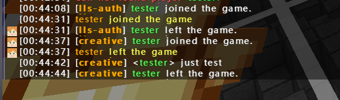
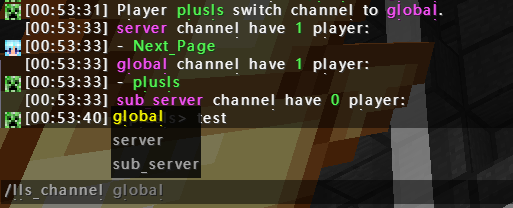
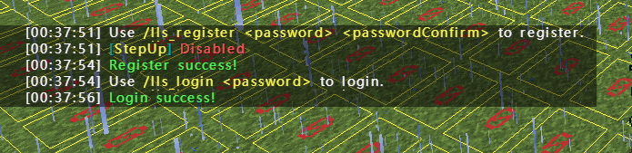
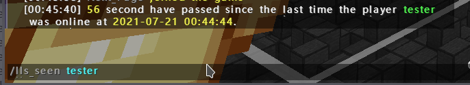

# lls-manager

A velocity plugin to manage server, such as whitelist, chat bridge, remember last server, offline auth.

This plugin still in beta.

## Config file

Config file example.

### Main Config

Main config file example.

```json5
{
  // allow bridge chat message
  "bridgeChatMessage": true,
  // send message to all server when player join
  "bridgePlayerJoinMessage": true,
  // send message to all server when player leave
  "bridgePlayerLeaveMessage": true,
  // whitelist
  "whitelist": true,
  // default use mojang auth
  "defaultOnlineMode": true,
  // default channel
  "defaultChannel": "server",
  // this server will be used to auth.
  "authServerName": "lls-auth",
  // Player in this channel will receive the message in server.
  "chatMessageChannelList": [
    "server",
    "global"
  ],
  // If player in this channel, player's chat will be bridge.
  "bridgeMessageChannelList": [
    "server",
    "global"
  ],
  // Player in this channel will receive the message of player leave message.
  "leaveMessageChannelList": [
    "server",
    "global"
  ],
  // Player in this channel will receive the message of player join message.
  "joinMessageChannelList": [
    "server",
    "global"
  ]
}   
```

### Player Config

Player config example.

```json5
{
  "onlineMode": true,
  "password": "",
  "lastServerName": "survival",
  "channel": "global",
  "lastSeenTime": "Jul 21, 2021, 1:12:18 AM"
}
```

### Whitelist Config

Whitelist config example.

```json5
{
  "whiteList": [
    "plusls"
  ]
}
```

## Features

The features of lls-manager

### Chat Bridge

lls-manager will forward the chat from other server.



#### Channel
lls-manager has a channel system, default if player in `server` or `global` channel, their message will be forwarded.

If player in `sub_server` channel, their chat will not be forwarded.




### Offline Auth

lls-manager support offline-auth and mojang auth. I will check the username and find the user config. 

If the `onlineMode` field in player config is false, it will use offline auth.

The offline auth need an `auth server` to auth user. It is very recommend to set game mode to **spectator** in Auth server, because player can do **everything** in auth server **except run command**.

The player who is not logged in just can run `/lls_register` and `/lls_login`.

After player logged in, player can use `/server` command to join other sub-server.



#### Note

When `defaultOnlineMode` is true, if server admin want to add a new offline auth user, should use `/lls_create_player <username>` to create a dummy user, and use `/lls_player <username> setOnlineMode false` to set user to offline mode.

When `defaultOnlineMode` is false, if server admin want to add a new mojang auth user, should use `/lls_player <username> setOnlineMode true` to set user to online mode.


### Whitelist

A custom whitelist system use username.


### Remember last server

It will remember the last logged in server of player.


### Compat

It compat with [Floodgate](https://github.com/GeyserMC/Floodgate/wiki)


## Command

The command in lls-manager.

### lls_whitelist

need permission `lls-manager.admin`

+ /lls_whitelist add <username>
+ /lls_whitelist remove <username>
+ /lls_whitelist list
+ /lls_whitelist reload
+ /lls_whitelist status
+ /lls_whitelist on
+ /lls_whitelist off

### lls_channel

#### Show all channel.

+ /lls_channel

#### Switch channel

+ /lls_channel <channel>


### lls_login

Login command

+ /lls_login <password>


### lls_register

register

+ /lls_passwd <password> <passwordConfirm>


### lls_passwd

Change password

+ /lls_passwd <password> <passwordConfirm>

### lls_seen

See the last login time of player.

+ /lls_seen <username>



### lls_player

need permission `lls-manager.admin`

A command to manage player data.
+ /lls_player <username> resetPassword
+ /lls_player <username> setOnlineMode <status>
+ /lls_player <username> setChannel <channel>

### lls_create_player

need permission `lls-manager.admin`

A command to create a user with default config.

+ /lls_create_player <username>